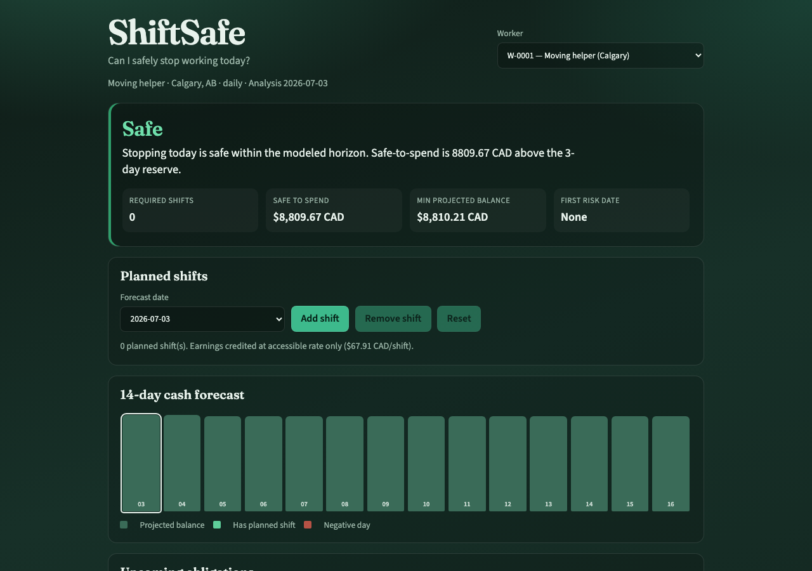
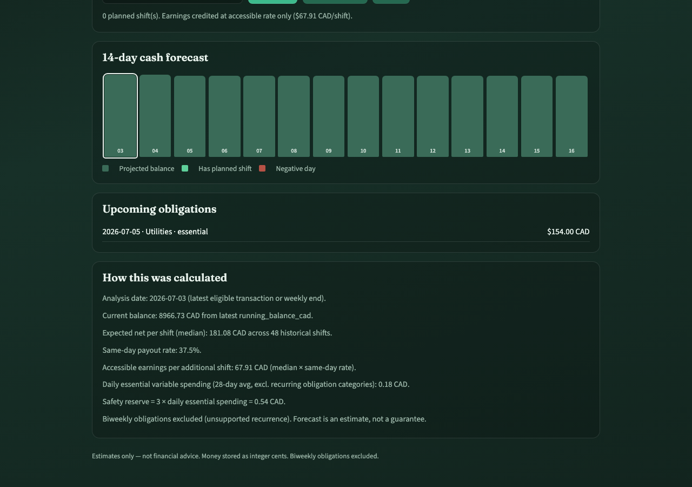
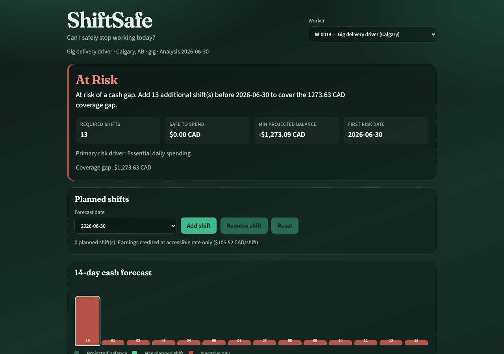
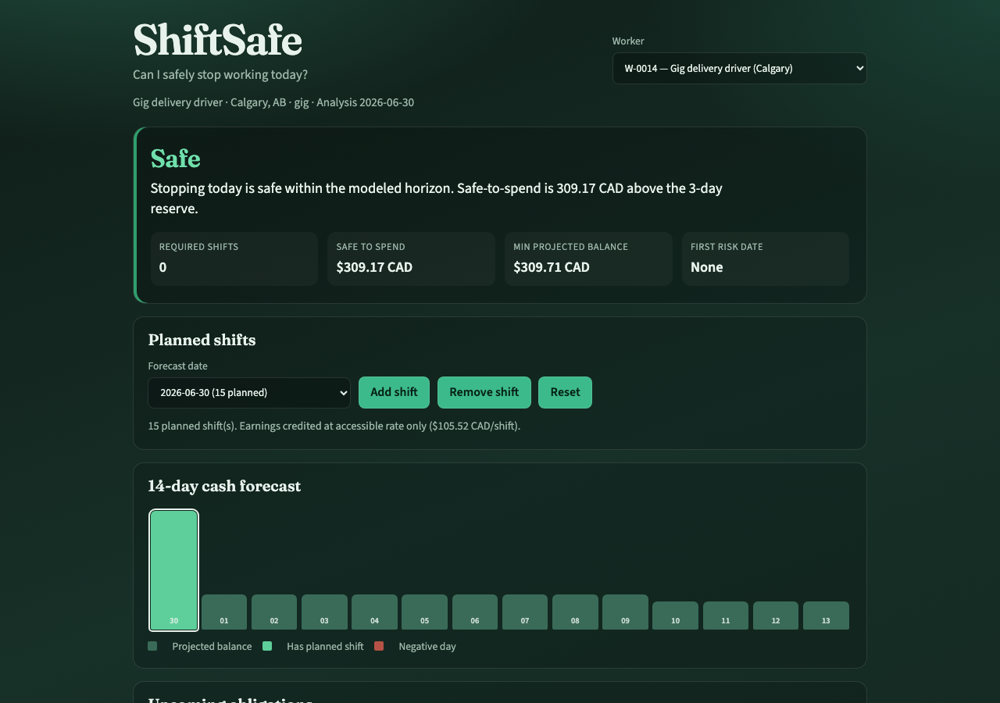
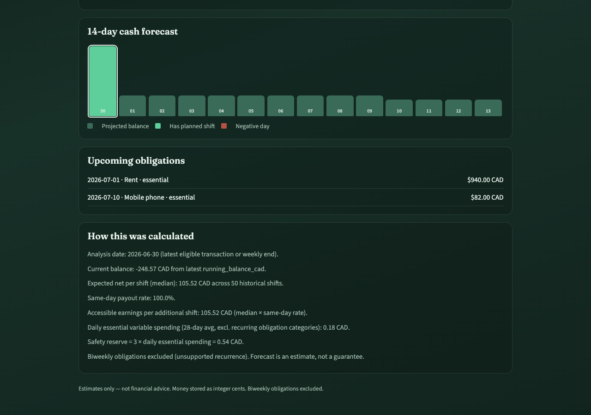

# ShiftSafe

**Can an irregular-income worker safely stop working today — and how many additional shifts prevent the next cash gap?**

ShiftSafe is a daily work-decision engine. It combines shift earnings, same-day payout availability, recurring obligations, essential spending, and current cash position into a 14-day forecast with a clear Safe / Caution / At Risk recommendation.

## Hosted demo

**Blocker:** Hosted URL pending authentication.

- `vercel whoami` → invalid token (`vercel login` required)
- `gh auth status` → invalid GitHub token (`gh auth login` required)

Verified locally with `npm run build && npm run preview` (production `dist/`).

After auth, deploy with `vercel --prod --yes` and replace this section with the public URL.

## Worker problem

Monthly earnings can look fine while payment timing still creates short-term cash gaps. Traditional budgets answer “where did money go?” — not “must I work another shift before rent hits?”

## Product solution

For any selected worker in the dataset, ShiftSafe:

1. Sets the analysis date from the latest transaction (weekly summary fallback).
2. Projects 14 calendar days of cash using accessible planned-shift earnings, monthly obligations, and essential variable spending.
3. Classifies Safe / Caution / At Risk against a 3-day safety reserve.
4. Calculates required additional shifts and safe-to-spend.
5. Lets the worker add/remove planned shifts and recalculate immediately.

## Core demonstration flow

1. Select a worker (try `W-0014` for At Risk).
2. Read the status, recommended action, required shifts, and safe-to-spend.
3. Review the 14-day forecast and upcoming obligations.
4. Add planned shifts on forecast dates before the first risk date.
5. Watch status, coverage gap, and recommendation update.
6. Read the calculation explanation for assumptions.

## Screenshots











## Architecture and data flow

```text
CSV datasets (static)
  → parse + index by worker_id
  → pure decision engine (integer cents)
  → React UI (select worker → scenario → recalculate)
```

No backend, database, authentication, or external financial APIs.

## Calculation methodology

- Money stored as **integer cents**.
- **Analysis date** = latest transaction date (else end of latest weekly summary week).
- **Current balance** = latest `running_balance_cad` ≤ analysis date (else weekly `ending_balance_cad`).
- **Expected net per shift** = median historical `net_pay_cad` ≤ analysis date.
- **Same-day payout rate** = same-day-paid shifts / total historical shifts.
- **Accessible earnings per shift** = expected net × same-day rate (delayed pay treated conservatively).
- **Daily essential spending** = essential non-recurring debits over prior 28 days ÷ 28 (categories matching the worker’s essential monthly obligations excluded to reduce double-counting).
- **Safety reserve** = 3 × daily essential spending.
- **Forecast** = 14 days: prior balance + accessible planned-shift earnings − obligations due − daily essential spend.
- **Required shifts** = ceil(coverage gap / accessible earnings), or Unavailable if accessible earnings are 0.
- **Safe-to-spend** = max(0, min projected balance − reserve).
- **Biweekly obligations excluded** (schedule not verifiable from `due_day_of_month` alone).

Forecasts are estimates, not guarantees.

## Dataset usage

| Dataset | Role |
|---|---|
| `workers.csv` | Worker selection / context |
| `transactions.csv` | Balance + essential spending |
| `daily_earnings.csv` | Median earnings + same-day payout |
| `recurring_obligations.csv` | Monthly obligations in horizon |
| `weekly_cashflow_summary.csv` | Balance fallback only |

`earned_wage_advances.csv` is not used. Join key: `worker_id`.

## Local setup

```bash
npm install
npm run dev
```

## Tests

```bash
npm test
```

Critical coverage: Safe / At Risk classification, required-shift math, future-data leakage, zero accessible earnings → Unavailable, integer cents, scenario status change, insufficient data.

## Build

```bash
npm run build
npm run preview
```

## Assumptions and limitations

- Static anonymized dataset only; no live bank connections.
- Delayed earnings have no explicit pay date — modeled via same-day payout rate.
- Only **monthly** recurrence is implemented; **biweekly** rows are excluded and disclosed.
- Reserve fixed at three days; not user-adjustable.
- Wage advances, custom analysis dates, and spending-reduction scenarios are out of scope.
- Not financial advice.

## Solo-builder scope and learning

Built as a constrained solo MVP: real multi-dataset forecasting, conservative payout modeling, scenario simulation, automated decision tests, and a static deployable UI focused on one question — whether stopping work today is financially safe.

## Deployment note

Vercel CLI is installed but the current token is invalid (`vercel login` required). After login:

```bash
vercel --prod --yes
```

Or serve `dist/` via GitHub Pages / any static host. Update this README with the public URL once hosted.
